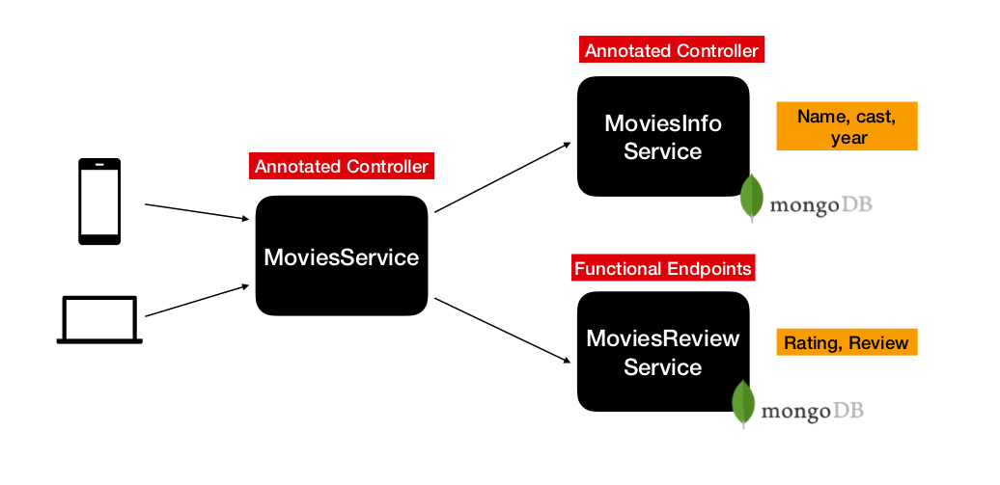

# Reactive Programming

 Here in this project we have build microservices application using reactive approach. 

- Have used Spring WebFlux as web framework to build non-blocking applications.
- Have used MariaDb to store data and its non-blocking API's to connect in a reactive style.
- Have used WebClient API to connect with other services in a non-blocking style.
- Controllers in movie-info-service and movie-service was created using Annotation (how we do for in Spring MVC - Rest API's).
- Controller in movie-review-service was created using Functional Endpoints. Its a new way of creating endpoints in funcational style.

